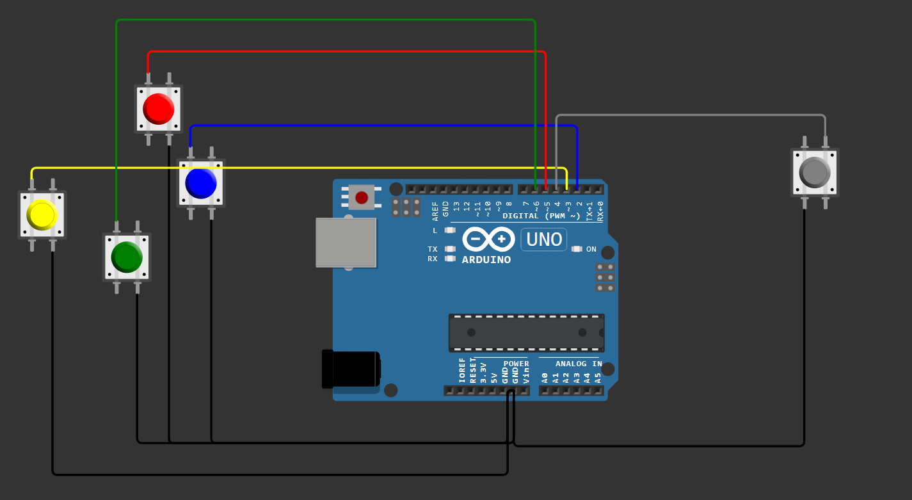

# DIY PC Gaming Controller with Arduino & Python 🎮

A custom, breadboard-built PC gaming controller that maps physical push buttons to standard PC gaming inputs (W, A, S, D, Space). 

This project bridges the gap between hardware and software by sending microcontroller serial data to a Python script, which then translates it into DirectX-level keystrokes using the `pydirectinput` library. It was successfully tested to drive cars in *Asphalt*!

## 🛠️ Hardware Requirements
* 1x Arduino (Uno or Nano)
* 5x Tactile Push Buttons
* Breadboard & Jumper Wires
* USB Cable for PC connection

## 🔌 Circuit Schematic
The circuit utilizes the Arduino's internal `INPUT_PULLUP` resistors, keeping the wiring incredibly simple with zero external resistors required.



**Pin Mapping:**
* **D2:** Right (D)
* **D3:** Left (A)
* **D4:** Action (Spacebar)
* **D5:** Forward (W)
* **D6:** Backward (S)

## 💻 Software Setup

### 1. Arduino Firmware (C++)
Upload the following code to your Arduino using the Arduino IDE. This code monitors the pins and sends an ultra-low latency serial string (e.g., `5P` for Press, `5R` for Release) only when a state changes.

```cpp
const int pins[] = {2, 3, 4, 5, 6};
int lastStates[5];

void setup() {
  Serial.begin(9600);
  
  for (int i = 0; i < 5; i++) {
    pinMode(pins[i], INPUT_PULLUP);
    lastStates[i] = HIGH; 
  }
}

void loop() {
  for (int i = 0; i < 5; i++) {
    int currentState = digitalRead(pins[i]);
    
    if (currentState != lastStates[i]) {
      Serial.print(pins[i]);
      
      if (currentState == LOW) {
        Serial.println("P"); 
      } else {
        Serial.println("R");
      }
      
      lastStates[i] = currentState;
    }


  }
  delay(10); // Debounce
}

````


2. Python Bridge
The Python script listens to the COM port and executes the DirectX-level keystrokes.

Prerequisites:

Bash
```
pip install pyserial pydirectinput
```
controller.py:
(Note: Change 'COM5' to match your active Arduino port)

Python
```
import serial
import pydirectinput

# Pin 2=D, 3=A, 4=Space, 5=W, 6=S
key_map = {
    "2": "d", "3": "a", "4": "space", "5": "w", "6": "s" 
}

ser = serial.Serial('COM5', 9600, timeout=1)
print("Controller Active! Press Ctrl+C to stop.")

while True:
    if ser.in_waiting > 0:
        line = ser.readline().decode('utf-8').strip()
        
        if len(line) >= 2:
            pin = line[:-1]
            action = line[-1]
            
            if pin in key_map:
                key = key_map[pin]
                if action == "P":
                    pydirectinput.keyDown(key)
                else:
                    pydirectinput.keyUp(key)
```
🚀 How to Play
Connect your Arduino to the PC.

Ensure the Arduino IDE Serial Monitor is closed (otherwise Python will throw an "Access is denied" error).

Run the Python script: python controller.py

Launch your game and play!

🔮 Future Improvements
Upgrade the 4 directional buttons to a dual-axis analog joystick mapping.

Integrate NRF24L01 transceivers for a fully wireless experience.
